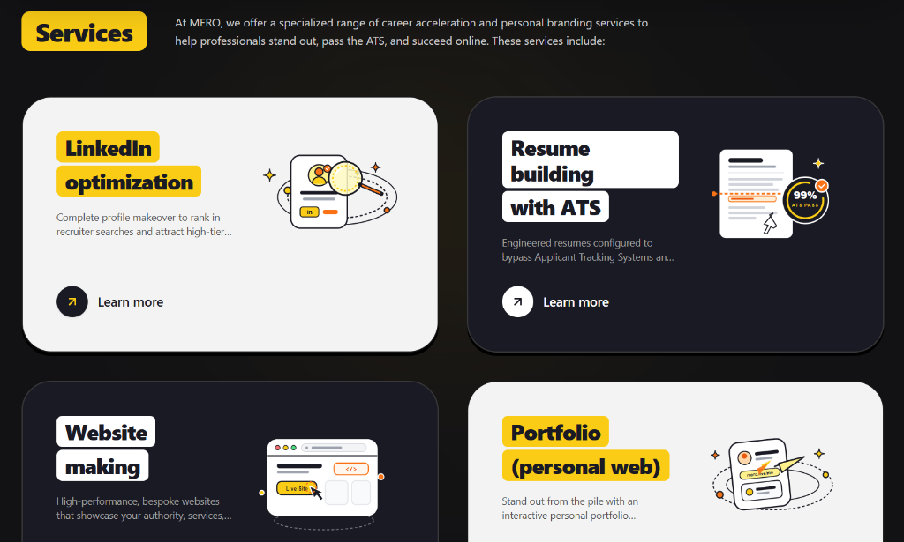

<div align="center">

# ⚡ MERO
### Executive Career Acceleration & Personal Branding Platform

[](https://m4mero.vercel.app)
[](https://nextjs.org/)
[](https://react.dev/)
[](https://tailwindcss.com/)
[](https://www.typescriptlang.org/)
[](LICENSE)

<br />

<!-- Hero Image Preview -->
<a href="https://m4mero.vercel.app">
  
</a>

<br />
<br />

**MERO** is a high-impact personal branding platform engineered for developers, builders, and executives. From reverse-engineered ATS resumes and algorithmic LinkedIn profile optimization to live personal web portfolios and high-speed web apps — MERO builds your entire digital footprint into an executive-level opportunity magnet.

[**Explore Live Website →**](https://m4mero.vercel.app)

</div>

---

## 🌟 Highlights & Features

### 1. 💼 Positivus Neo-Brutalist Services Suite (`/services`)
Custom-built with high-contrast neo-brutalist cards, solid drop shadows, and handcrafted line-art vectors in the signature MERO theme (*Orange, Brand Yellow, and White*):

- **LinkedIn Optimization**: Recruiter search keyword injection, high-converting storytelling headline and *About* section, and quantifiable achievement highlights.
- **Resume Building with ATS**: 99% ATS match rate, semantic keyword mapping, and XYZ metric-driven bullet points designed to bypass automated filters and impress hiring managers.
- **Website Making**: High-performance, bespoke web storefronts built on Next.js 16 and React 19 with 95+ Google Lighthouse speed scores.
- **Portfolio (Personal Web)**: Permanent interactive home on the web with custom domain support (`satyajitdas.in`), proof-of-work showcases, and instant resume downloads.
- **Interactive Detail Modal**: Deep-dive preview for each service detailing deliverables, turnaround times, and 1-click consultation bookings.

### 2. 🎛️ Brand Control & Search Preview
- **SEO & Social Snippet Control**: Preview and customize how search engines and social platforms index your profile before publishing.
- **Mood Switcher**: Seamlessly switch typography moods between clean technical (*SIGNAL*) and bold executive (*ATELIER*) without rewriting content.

### 3. 📬 Interactive Contact Portal (`/contact`)
- **Seamless Inquiry Form**: Multi-field form for discovery calls and bespoke package inquiries with instant feedback.
- **Resource Center**: Built-in access to knowledgebase articles, FAQs, office presence details, and direct email channels (`support@mero.live`).

### 4. 🚀 High-Converting Landing Flow
- **AI Resume Engine Showcase**: Interactive 98% ATS Circular Score radar and keyword match visualization.
- **Customer Stories Carousel**: Proven results from real projects including **mero**, **NeedMet**, **Bookmipg**, and **Pathshala AI**.
- **Community & Confidence Banners**: High-trust conversion anchors that motivate career builders to take immediate action.

---

## 🛠️ Tech Stack & Architecture

| Layer | Technology | Description |
|---|---|---|
| **Framework** | [Next.js 16.3](https://nextjs.org/) | App Router, Turbopack, React Server Components (RSC) |
| **UI Library** | [React 19](https://react.dev/) | Concurrent rendering, latest hooks & components |
| **Styling** | [Tailwind CSS v4](https://tailwindcss.com/) | Cutting-edge `@tailwindcss/postcss` & custom CSS tokens |
| **Animations** | [Framer Motion](https://www.framer.com/motion/) | Smooth entrance reveals, layout transitions, and modals |
| **Icons** | [Lucide React](https://lucide.dev/) | Clean, featherweight SVG icon system |
| **Typography** | [Geist Sans & Mono](https://vercel.com/font) | High-legibility modern variable fonts |
| **Deployment** | [Vercel](https://vercel.com/) | Edge network global distribution & automatic CI/CD |

---

## 📂 Project Directory Structure

```text
MIRO/
├── public/                     # Static assets, branding & preview images
│   ├── preview.png             # GitHub hero preview screenshot
│   ├── brand-logo-dark.png     # Dark mode logo
│   └── favicon.svg             # Favicon assets
├── src/
│   ├── app/
│   │   ├── contact/
│   │   │   └── page.tsx        # Dedicated /contact page route
│   │   ├── services/
│   │   │   └── page.tsx        # Dedicated /services page route
│   │   ├── globals.css         # Tailwind v4 imports & theme color tokens
│   │   ├── layout.tsx          # Root layout with Navbar & Footer
│   │   └── page.tsx            # Main Home page landing flow
│   ├── components/
│   │   ├── layout/
│   │   │   ├── Navbar.tsx      # Floating pill navbar with active route tracking
│   │   │   └── Footer.tsx      # Comprehensive site footer & newsletter
│   │   ├── sections/
│   │   │   ├── Hero.tsx            # High-impact hero with interactive badges
│   │   │   ├── FeatureBento.tsx    # ATS resume score & Bento feature grid
│   │   │   ├── BrandControl.tsx    # Search snippet preview & style switchers
│   │   │   ├── RolesShowcase.tsx   # All-in-one solution touchpoints
│   │   │   ├── ServicesSection.tsx # Positivus Neo-Brutalist 2x2 services grid
│   │   │   ├── ContactSection.tsx  # Sleek dark form & resources grid
│   │   │   ├── CustomerStories.tsx # Interactive client testimonial carousel
│   │   │   ├── SocialProof.tsx     # Executive credibility stats
│   │   │   ├── ConfidenceBanner.tsx# High-trust conversion banner
│   │   │   └── FinalCTA.tsx        # Geometric 3D cube closing CTA
│   │   └── ui/
│   │       └── BrandLogo.tsx       # Theme-reactive SVG logo
│   └── context/
│       └── ThemeContext.tsx    # Theme provider
├── package.json
└── tsconfig.json
```

---

## ⚡ Getting Started Locally

### Prerequisites
Make sure you have [Node.js](https://nodejs.org/) installed (v18.18+ or v20+ recommended).

### 1. Clone the repository
```bash
git clone https://github.com/dassatyajitdas2005/MERO.git
cd MERO
```

### 2. Install dependencies
```bash
npm install
```

### 3. Run the development server
```bash
npm run dev
```

Open [http://localhost:3000](http://localhost:3000) with your browser to experience the application.

### 4. Build for production
```bash
npm run build
npm run start
```

---

## 🌐 Deployment

The application is deployed on Vercel with automatic continuous integration:

- **Live URL**: [https://m4mero.vercel.app](https://m4mero.vercel.app)
- **Repository**: [https://github.com/dassatyajitdas2005/MERO](https://github.com/dassatyajitdas2005/MERO)

---

## 👨‍💻 Author

**Satyajit Das**
- GitHub: [@dassatyajitdas2005](https://github.com/dassatyajitdas2005)
- Website: [satyajitdas.in](https://satyajitdas.in)
- Platform: [m4mero.vercel.app](https://m4mero.vercel.app)

---

## 📄 License

This project is licensed under the MIT License — see the [LICENSE](LICENSE) file for details.
